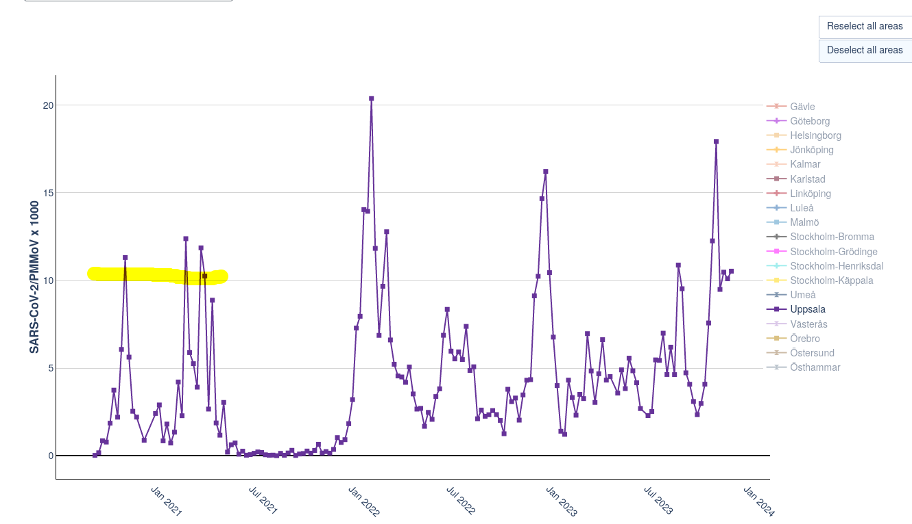
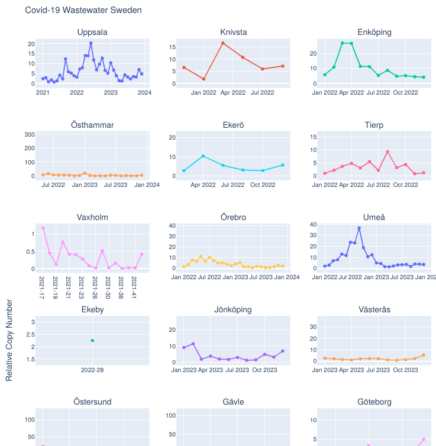

# Swedish Wastewater Data Viz
This is a work in progress to visualize Swedish covid wastewater data.

## Please Note
This is a WIP. It has only undergone minor quality control.

## Current Status

### Countries visualized on Map (choropleth)

Relative Copy Number Cap was created by simple heuristic to in order to have the color meaning not being relative to included time period or country overall (which also might be effected by data of other countries or lack of reporting of one or another country. This will facilitate and standardize interpretability within Sweden for now, which later will be reviewed as more countries are added.
The range of Relative Copy Number is fixed based a heuristic based on Uppsala Wastewater during the first data wave. Uppsala a stable measurement across time, and as far as I remember Sweden had a very high transmission of SARS-CoV-2 during this time. I think it should serve as a decent estimate on the degree of covid transmission. 

Trendline charts:

#For questions, suggestions, requests or ideas:
Contact me on twitter @dynesius_
