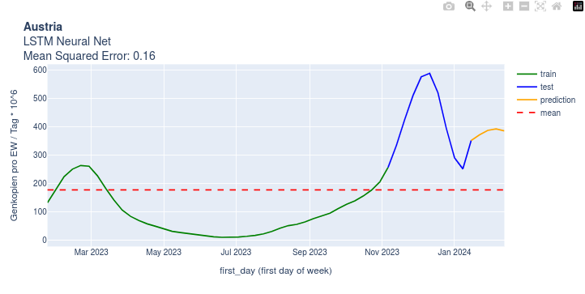

      
    <strong>Covid Fox Monitoring</strong>  
    A Covid Wastewater  Project

## Project Direction
#### There are several <b>aims</b> that I want to fulfill with this project. 
* Give People An Overview of Current Covid Transmission Levels
* Collect & Share Data Sources for people to use for their Covid-projects
  
#### In order to fulfill these aims the current project direction is  
* Find more Datalinks to Covid Wastewater Data 🔨👷🚧⚠️  In Progress
* Find ways to use social media data ⌠Cancelled
* Find ways to pull aggregated google trends search terms data by region 
* Find ways to pull aggregated mobility data per region
* Forecast covid transmission per country 1-4+ weeks ahead &#10004; Completed
* Forecasts per region
* Improve forecasts
* Add variant data for better predictions 🔨👷🚧⚠️  In Progress
* Improved data standardization 🔨👷🚧⚠️  In Progress
  
#### Reliability of The Project
* Find ways of better hosting (URGENT - Exceeding free github tier)  &#10004; Completed
* Data Quality Control 
* Implementation of proper CI/CD pipeline
* Testing prior to releases
* Full automation of independent daily updates
  

#### Outside of Scope (Currently)
* Simulations of NPI's & transmission level
  
  
#### Please Note: The graphs and data are to be interpreted carefully.

 

### Current Status

[Link to Covid-19 Wastewater Monitoring Website (Click Here!)](https://danieldynesius.github.io/covid/)

 

### Colorization Rule (Current)
<b>Interpretation</b>
* <b>Sweden:</b> Red = "High Transmission". Based on the height of Uppsala wastewater measures during wave 1 2020.
* <b>All Other Countries:</b> Red = "Relatively High Transmission". Based on each country separately relative to the Min-Max values in the timeperiod.
* <b>Withinin</b> country comparisons can be made.
* <b>Between</b> country comparisons should <i>ONLY</i> be made with careful interpretation. The colors are relative, so I *believe* only relative time dimension interpretations are possible. NOT degree of transmission on a specific week. The reason is that almost each country uses different metrics to track transmission.

 

The Heuristic of the Swedish Cut-off Value of 10 and above indicated as "high transmission" (red).

   

## Trendline Charts
Later might update the trend graphs. The trick is to figure out how to create a concise & intuitive overview.

## Prediction Models
A simple Neural Net implemented. <b> Caution:</b> Very early stage. Interpret carefully.
Known issues: 
* Bugs when running for some countries e.g. Finland and Poland.
* Will <b>not</b> capture sudden strong spikes.

## Questions?
For questions, suggestions, requests or ideas:
Contact me on twitter or linkedin.

[ LinkedIn](https://www.linkedin.com/in/danieldynesius/)&nbsp;

[Email: daniel.dynesius@stratega.ai](mailto:daniel.dynesius@stratega.ai)